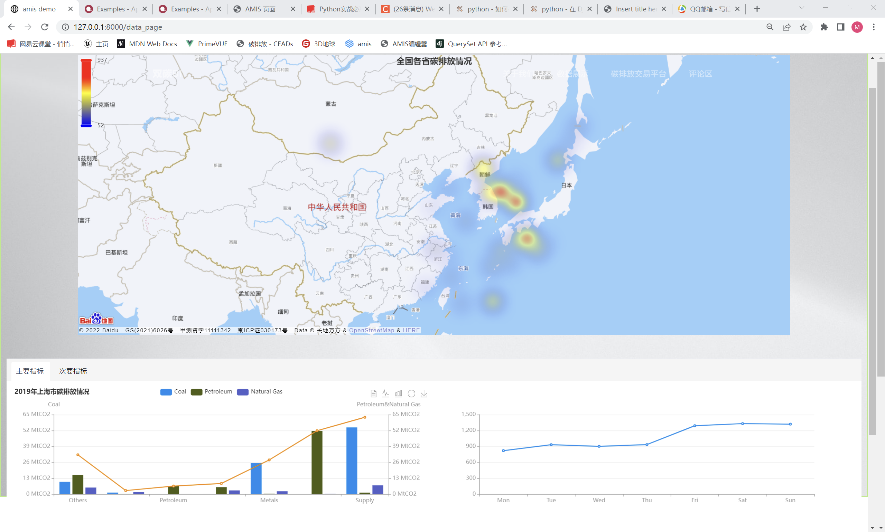
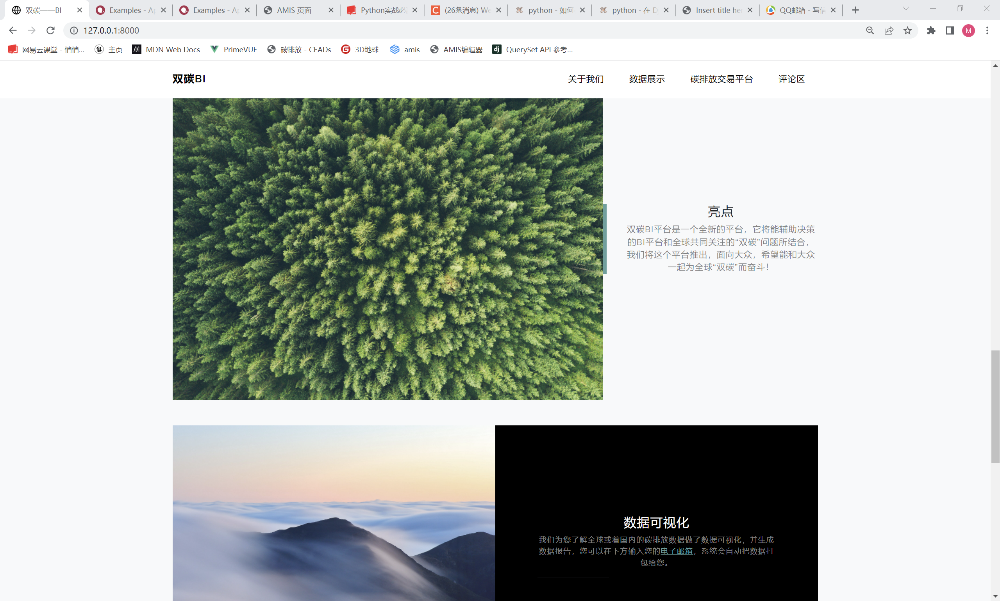
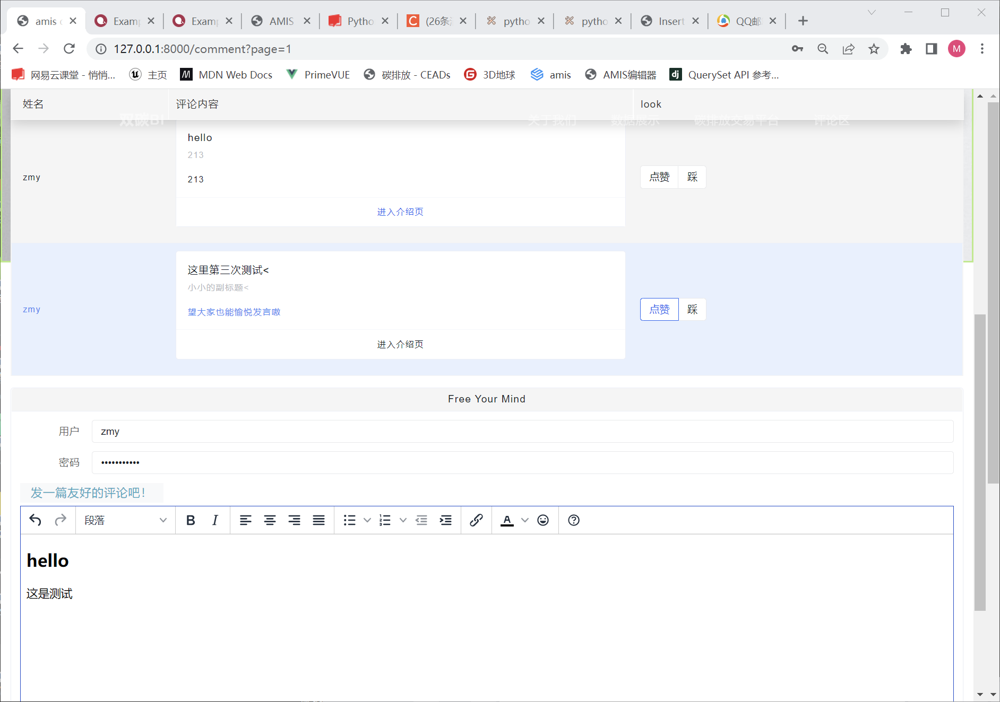

[**简体中文**](#-bi-carbon-基于双碳大数据的可视化bi系统) | [**English**](#-bi-carbon-a-visual-bi-system-for-dual-carbon-big-data)

# BI-carbon: 基于“双碳”大数据的可视化BI系统

[](https://www.python.org/)
[](https://www.djangoproject.com/)
[](https://aisuda.bce.baidu.com/amis/zh-CN/docs/index)
[](https://opensource.org/licenses/MIT)

---

**BI-carbon** 是一个公益性质的轻量级商业智能（BI）平台，旨在将中国的“双碳”战略目标与大数据可视化技术相结合。我们致力于打破传统数据平台的壁垒，让企业、研究人员、政府乃至普通大众，都能以最直观的方式获取和理解碳排放相关数据。

本平台以[中国碳核算数据库 (CEADs)](https://www.ceads.net.cn/) 的授权数据为基础，通过友好的交互界面，提供数据可视化、深度分析报告和自定义数据探索等功能，促进“双碳”知识的普及与交流。

## ✨ 主要功能

* **多维度数据可视化**：提供基于 ECharts 和百度地图 API 的动态图表与热力图，直观展示各省市碳排放数据。
* **数据分析报告**：自动生成关键指标的数据分析报告，帮助用户快速洞察数据背后的含义。
* **碳排放交易数据平台**：
    * 强大的**条件筛选**功能，用户可按需查询、过滤数据。
    * 根据筛选结果**一键生成可视化图表**（柱状图、饼图、折线图等）。
    * 支持将筛选后的数据以 `.csv` 格式**异步发送到指定邮箱**。
* **开放式评论区**：提供一个用户可以登录、发表见解、交流看法的互动社区。
* **后台管理系统**：基于 Django 自带的管理后台，方便管理员直接对数据库进行增、删、查、改操作。

## 🛠️ 技术栈

* **后端**：Django (4.0.2)
* **前端**：[Amis](https://aisuda.bce.baidu.com/amis/zh-CN/docs/index) (百度低代码前端框架) + Bootstrap
* **数据库**：SQLite (轻量、便捷，完美契合项目定位)
* **核心库**：
    * `pandas` & `numpy`: 用于高效的数据处理和分析。
    * `django-pandas`: 简化了 Django ORM 与 Pandas DataFrame 之间的转换。
    * `django-q`: 实现邮件发送等异步任务处理。
    * `Faker`: 用于生成测试所需的模拟数据。
* **数据缓存**：利用 Django 的数据库缓存后端，显著提升数据查询和图表生成效率（测试中速度提升近6倍）。

## 📸 系统截图

| 首页                                       | 数据展示 & 分析报告                               |
| :----------------------------------------- | :------------------------------------------------ |
|       |     |
| **首页** | **评论区** |
|  |  |

## 🚀 安装与启动

请确保您的系统已安装 **Python 3.8**。

### 1. 克隆仓库

```bash
git clone [https://github.com/your-username/bi_carbon.git](https://github.com/your-username/bi_carbon.git)
cd bi_carbon
```

### 2. 安装依赖

项目所需的第三方库已在 `requirements.txt` 中列出。

```bash
pip install -r requirements.txt
```

<details>
<summary>点击查看详细依赖列表</summary>

| Package       | Version  |
| :------------ | :------- |
| datetime      | 4.4      |
| django        | 4.0.2    |
| django_pandas | 0.6.6    |
| django-q      | 1.3.9    |
| Faker         | 13.3.1   |
| numpy         | 1.19.3   |
| pandas        | 1.4.1    |
| pytz          | 2021.3   |
| uuid          | 1.30     |
| yagmail       | 0.15.277 |

</details>

### 3. 初始化数据库

```bash
# 生成迁移文件
python manage.py makemigrations

# 应用数据库迁移
python manage.py migrate
```

### 4. (可选) 生成模拟数据

为了测试“碳排放交易数据平台”，您可以生成指定数量的模拟订单数据。

```bash
# 生成 2000 条模拟数据
python manage.py addfakeorders 2000
```

### 5. 启动服务

您需要启动两个服务：Django Web 服务和 Django-Q 异步任务服务。

**终端 1：启动 Web 服务**

```bash
python manage.py runserver
```

服务将运行在 `http://127.0.0.1:8000/`。

**终端 2: 启动异步任务集群 (用于发送邮件)**

```bash
python manage.py qcluster
```

现在，打开浏览器访问 <http://127.0.0.1:8000/>，即可开始使用！

## 🤝 贡献者

* **makerzhu (队长)**: 项目总设计，前后端开发，数据库设计，异步任务系统实现。

## ❤️ 致谢

* 感谢 **中国碳核算数据库 (CEADs)** 团队提供的数据授权与支持。
* 感谢百度 **Amis** 团队开发的优秀低代码前端框架。

## 📄 许可

本项目采用 [MIT License](https://opensource.org/licenses/MIT) 开源许可。

---
<br>

# BI-carbon: A Visual BI System for "Dual Carbon" Big Data

[](https://www.python.org/)
[](https://www.djangoproject.com/)
[](https://aisuda.bce.baidu.com/amis/zh-CN/docs/index)
[](https://opensource.org/licenses/MIT)

---

**BI-carbon** is a non-profit, lightweight Business Intelligence (BI) platform designed to integrate China's "dual carbon" strategic goals with big data visualization technology. We are committed to breaking down the barriers of traditional data platforms, enabling enterprises, researchers, government, and the general public to access and understand carbon emission data in the most intuitive way.

This platform is based on authorized data from the [China Carbon Accounting Database (CEADs)](https://www.ceads.net.cn/) and provides data visualization, in-depth analysis reports, and custom data exploration through a user-friendly interface to promote the popularization and exchange of "dual carbon" knowledge.

## ✨ Main Features

* **Multi-dimensional Data Visualization**: Provides dynamic charts and heatmaps based on ECharts and Baidu Maps API for intuitive display of carbon emission data across provinces and cities.
* **Data Analysis Reports**: Automatically generates data analysis reports for key indicators to help users quickly gain insights from the data.
* **Carbon Emission Trading Data Platform**:
    * Powerful **conditional filtering** function for users to query and filter data as needed.
    * **One-click generation of visual charts** (bar charts, pie charts, line charts, etc.) based on filtered results.
    * Supports **asynchronously sending filtered data** in `.csv` format to a specified email address.
* **Open Comment Section**: Provides an interactive community where users can log in, express opinions, and exchange views.
* **Admin Backend System**: Based on Django's built-in admin backend, allowing administrators to directly perform CRUD operations on the database.

## 🛠️ Tech Stack

* **Backend**: Django (4.0.2)
* **Frontend**: [Amis](https://aisuda.bce.baidu.com/amis/zh-CN/docs/index) (Baidu's low-code frontend framework) + Bootstrap
* **Database**: SQLite (Lightweight and convenient, perfectly matching the project's positioning)
* **Core Libraries**:
    * `pandas` & `numpy`: For efficient data processing and analysis.
    * `django-pandas`: Simplifies the conversion between Django ORM and Pandas DataFrame.
    * `django-q`: Implements asynchronous tasks such as sending emails.
    * `Faker`: For generating mock data needed for testing.
* **Data Caching**: Utilizes Django's database cache backend to significantly improve data query and chart generation efficiency (nearly 6x speed improvement in tests).

## 📸 System Screenshots

| Homepage                                       | Data Display & Analysis Report                               |
| :----------------------------------------- | :------------------------------------------------ |
|       |     |
| **Carbon Emission Trading Data Platform** | **Comment Section** |
|  | 
cd bi_carbon
```

### 2. Install dependencies

The required third-party libraries are listed in `requirements.txt`.

```bash
pip install -r requirements.txt
```

<details>
<summary>Click to see the detailed dependency list</summary>

| Package       | Version  |
| :------------ | :------- |
| datetime      | 4.4      |
| django        | 4.0.2    |
| django_pandas | 0.6.6    |
| django-q      | 1.3.9    |
| Faker         | 13.3.1   |
| numpy         | 1.19.3   |
| pandas        | 1.4.1    |
| pytz          | 2021.3   |
| uuid          | 1.30     |
| yagmail       | 0.15.277 |

</details>

### 3. Initialize the database

```bash
# Generate migration files
python manage.py makemigrations

# Apply database migrations
python manage.py migrate
```

### 4. (Optional) Generate mock data

To test the "Carbon Emission Trading Data Platform", you can generate a specified number of mock order data.

```bash
# Generate 2000 mock data entries
python manage.py addfakeorders 2000
```

### 5. Start the services

You need to start two services: the Django Web service and the Django-Q asynchronous task service.

**Terminal 1: Start the Web Service**

```bash
python manage.py runserver
```

The service will run at `http://127.0.0.1:8000/`.

**Terminal 2: Start the Asynchronous Task Cluster (for sending emails)**

```bash
python manage.py qcluster
```

Now, open your browser and navigate to <http://127.0.0.1:8000/> to get started!

## 🤝 Contributors

* **Zhu Maoyuan (Team Leader)**: Overall project design, frontend and backend development, database design, asynchronous task system implementation.

## ❤️ Acknowledgements

* Thanks to the **China Carbon Accounting Database (CEADs)** team for data authorization and support.
* Thanks to the Baidu **Amis** team for developing an excellent low-code frontend framework.

## 📄 License

This project is licensed under the [MIT License](https://opensource.org/licenses/MIT).
