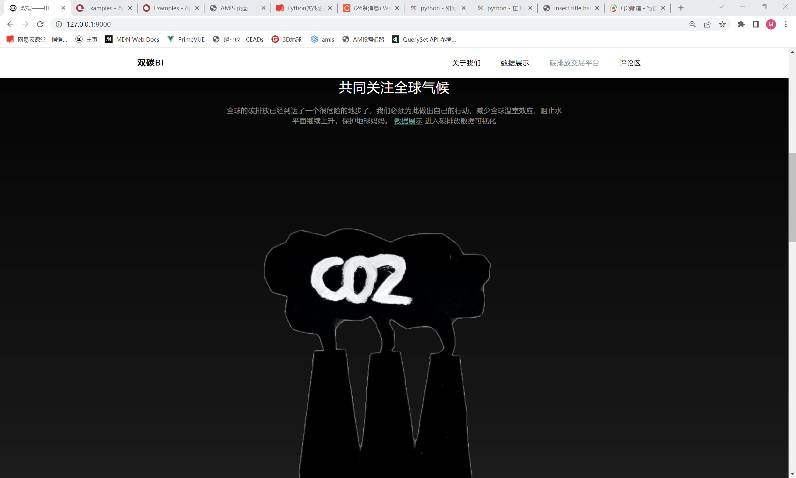
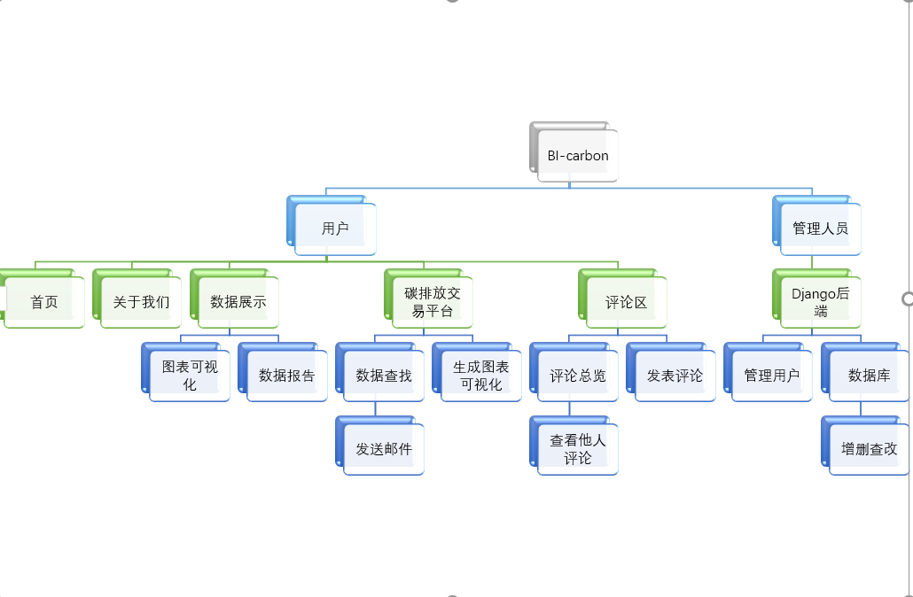

# BI-carbon: 基于“双碳”大数据的可视化BI系统

[](https://www.python.org/)
[](https://www.djangoproject.com/)
[](https://aisuda.bce.baidu.com/amis/zh-CN/docs/index)
[](https://opensource.org/licenses/MIT)

---

**BI-carbon** 是一个公益性质的轻量级商业智能（BI）平台，旨在将中国的“双碳”战略目标与大数据可视化技术相结合。我们致力于打破传统数据平台的壁垒，让企业、研究人员、政府乃至普通大众，都能以最直观的方式获取和理解碳排放相关数据。

本平台以[中国碳核算数据库 (CEADs)](https://www.ceads.net.cn/) 的授权数据为基础，通过友好的交互界面，提供数据可视化、深度分析报告和自定义数据探索等功能，促进“双碳”知识的普及与交流。

## ✨ 主要功能

* **多维度数据可视化**：提供基于 ECharts 和百度地图 API 的动态图表与热力图，直观展示各省市碳排放数据。
* **数据分析报告**：自动生成关键指标的数据分析报告，帮助用户快速洞察数据背后的含义。
* **碳排放交易数据平台**：
    * 强大的**条件筛选**功能，用户可按需查询、过滤数据。
    * 根据筛选结果**一键生成可视化图表**（柱状图、饼图、折线图等）。
    * 支持将筛选后的数据以 `.csv` 格式**异步发送到指定邮箱**。
* **开放式评论区**：提供一个用户可以登录、发表见解、交流看法的互动社区。
* **后台管理系统**：基于 Django 自带的管理后台，方便管理员直接对数据库进行增、删、查、改操作。

## 🛠️ 技术栈

* **后端**：Django (4.0.2)
* **前端**：[Amis](https://aisuda.bce.baidu.com/amis/zh-CN/docs/index) (百度低代码前端框架) + Bootstrap
* **数据库**：SQLite (轻量、便捷，完美契合项目定位)
* **核心库**：
    * `pandas` & `numpy`: 用于高效的数据处理和分析。
    * `django-pandas`: 简化了 Django ORM 与 Pandas DataFrame 之间的转换。
    * `django-q`: 实现邮件发送等异步任务处理。
    * `Faker`: 用于生成测试所需的模拟数据。
* **数据缓存**：利用 Django 的数据库缓存后端，显著提升数据查询和图表生成效率（测试中速度提升近6倍）。

## 📸 系统截图

| 首页                                       | 数据展示 & 分析报告                               |
| :----------------------------------------- | :------------------------------------------------ |
|       |     |
| **首页** | **评论区** |
|  |  |

## 🚀 安装与启动

请确保您的系统已安装 **Python 3.8**。

### 1. 克隆仓库

```bash
git clone [https://github.com/your-username/bi_carbon.git](https://github.com/your-username/bi_carbon.git)
cd bi_carbon
```

### 2. 安装依赖

项目所需的第三方库已在 `requirements.txt` 中列出。

```bash
pip install -r requirements.txt
```

<details>
<summary>点击查看详细依赖列表</summary>

| Package       | Version  |
| :------------ | :------- |
| datetime      | 4.4      |
| django        | 4.0.2    |
| django_pandas | 0.6.6    |
| django-q      | 1.3.9    |
| Faker         | 13.3.1   |
| numpy         | 1.19.3   |
| pandas        | 1.4.1    |
| pytz          | 2021.3   |
| uuid          | 1.30     |
| yagmail       | 0.15.277 |

</details>

### 3. 初始化数据库

```bash
# 生成迁移文件
python manage.py makemigrations

# 应用数据库迁移
python manage.py migrate
```

### 4. (可选) 生成模拟数据

为了测试“碳排放交易数据平台”，您可以生成指定数量的模拟订单数据。

```bash
# 生成 2000 条模拟数据
python manage.py addfakeorders 2000
```

### 5. 启动服务

您需要启动两个服务：Django Web 服务和 Django-Q 异步任务服务。

**终端 1：启动 Web 服务**

```bash
python manage.py runserver
```

服务将运行在 `http://127.0.0.1:8000/`。

**终端 2: 启动异步任务集群 (用于发送邮件)**

```bash
python manage.py qcluster
```

现在，打开浏览器访问 <http://127.0.0.1:8000/>，即可开始使用！

## 🤝 贡献者

* **makerzhu (队长)**: 项目总设计，前后端开发，数据库设计，异步任务系统实现。

## ❤️ 致谢

* 感谢 **中国碳核算数据库 (CEADs)** 团队提供的数据授权与支持。
* 感谢百度 **Amis** 团队开发的优秀低代码前端框架。

## 📄 许可

本项目采用 [MIT License](https://opensource.org/licenses/MIT) 开源许可。
